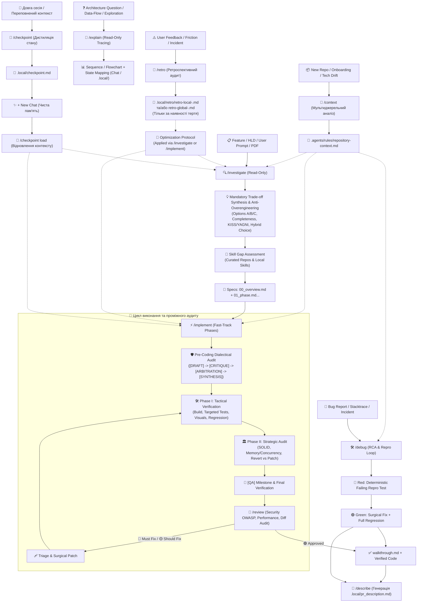

# Antigravity Workflows & Rules

Ця директорія містить оптимізовану інженерну конфігурацію, глобальні правила, воркфлови та повний набір спеціалізованих скілів для AI-агента **Google Antigravity**. Вони забезпечують надійний, автономний, самовдосконалюваний та безпечний цикл розробки програмного забезпечення на будь-якому стеку технологій.

---

## 🔄 Життєвий цикл розробки (End-to-End Pipeline)



---

## 📁 Структура директорій та встановлення

Конфігурація структурована за модульним принципом:

```
├── GEMINI.md                   # Глобальні правила, межі безпеки та протокол комунікації
├── scripts/                    # Системні PowerShell-утиліти для керування сесіями та кешем IDE
│   ├── antigravity-secondary-session.ps1  # Запуск ізольованої вторинної сесії (другий акаунт Google)
│   └── antigravity-workspaces-cleanup.ps1 # Мультипрофільне очищення кешу та сесій робочих просторів
└── config/
    ├── global_workflows/       # 9 основних воркфловів (Slash Commands)
    │   ├── context.md          # /context — ініціалізація та оновлення контексту репозиторія
    │   ├── investigate.md      # /investigate — аналіз, архітектура та декомпозиція
    │   ├── explain.md          # /explain — наскрізний трейсинг потоків даних та архітектури
    │   ├── implement.md        # /implement — тактична розробка та стратегічний аудит
    │   ├── debug.md            # /debug — детермінований RCA та виправлення багів
    │   ├── review.md           # /review — аудит diff, безпека та статична верифікація
    │   ├── describe.md         # /describe — лаконічний опис PR (.local/pr_description.md)
    │   ├── checkpoint.md       # /checkpoint — збереження та відновлення контексту між сесіями
    │   └── retro.md            # /retro — ретроспективний аудит сесії та промпт на оптимізацію
    └── skills/                 # 32 спеціалізовані інженерні скіли (Domain Capabilities)
```

### Як підключити:

1. **Глобально для всіх проектів (Рекомендовано):**
   - Скопіюйте вміст `config/` у `~/.gemini/config/` (або `C:\Users\<user>\.gemini\config\`).
   - Скопіюйте `GEMINI.md` у `~/.gemini/config/rules/GEMINI.md` (або `AGENTS.md`).
2. **Локально для окремого робочого простору:**
   - Розмістіть `GEMINI.md` (або `AGENTS.md`) у корені проєкту чи в `.agents/rules/`.
   - Розмістіть воркфлови у `.agents/workflows/`, а скіли у `.agents/skills/`.
   - Налаштуйте життєвий цикл хуків у `.agents/hooks.json`.

---

## 🛠️ Системні утиліти (`scripts/`)

У директорії `scripts/` розміщено утиліти автоматизації для адміністрування та паралельної роботи в Antigravity IDE:

### 1. `antigravity-secondary-session.ps1` (Паралельна сесія з іншим Google-акаунтом)
- **Призначення:** Запуск другого екземпляра IDE з повністю ізольованим каталогом даних (`%APPDATA%\Antigravity IDE - Secondary`), що дозволяє одночасно працювати з двома різними Google-акаунтами без конфліктів авторизації.
- **Архітектурні особливості:**
  - **Dynamic State Sync & WAL-Safety:** При первинній ініціалізації виконує безпечне клонування SQLite `state.vscdb` через нативний SQLite Online Backup API (`sqlite3.backup` з прапорцем `immutable=1`), що виключає пошкодження або блокування бази навіть при відкритій основній IDE.
  - **Auth Token Stripping:** Автоматично очищає токени та статус авторизації первинного профілю (`antigravityUnifiedStateSync.userStatus`, `antigravityUnifiedStateSync.oauthToken`, `antigravity.profileUrl`), відкриваючи чистий екран авторизації для другого акаунту.
  - **Extension & Config Sharing:** Забезпечує спільний доступ до встановлених розширень (`extensions`) та базових конфігурацій без необхідності їх повторного завантаження.
  - **Safe Execution:** Коректна передача параметрів командного рядка та робочих директорій без побічних ефектів переносу рядків.

### 2. `antigravity-workspaces-cleanup.ps1` (Мультипрофільне очищення робочих просторів)
- **Призначення:** Графічна WPF-утиліта для глибокого аудиту та безпечного вивільнення дискового простору, зайнятого кешами та сесіями IDE.
- **Функціонал та можливості:**
  - **Multi-Profile Support:** Сканує та агрегує кеші одночасно для всіх встановлених профілів — Primary (`%APPDATA%\Antigravity IDE`), Secondary (`%APPDATA%\Antigravity IDE - Secondary`) та інших сумісних папок.
  - **Комплексне очищення:** Видаляє застарілі дампи `workspaceStorage`, сесійні бекапи (`backupWorkspaces`), записи кешу стану (`state.vscdb`), а також роздуті транскрипти та логи агентів (`brain/<conversation-id>/`).
  - **Path Safety (`-LiteralPath`):** Усі файлові операції суворо ізольовані від випадкового розкриття спецсимволів (наприклад, шляхів із квадратними дужками `[` `]`), що запобігає збоям інтерпретатора PowerShell.
  - **Інтерактивний GUI:** Таблиця робочих просторів з розбивкою за профілями, розміром кешу, мітками часу останньої активності та фільтрами вибірки.

---

## 📜 Глобальні Правила (`GEMINI.md` / `AGENTS.md`)

- **High-Signal & Language Protocol (Rule A & E):** Zero Fluff, біонічне виділення ключових слів та висока інформаційна щільність; комунікація з користувачем — мовою запиту, кодові артефакти, специфікації та документація — суворо англійською.
- **Planning & Confirmation (Rule B):** Обов'язковий попередній аналіз та затвердження `implementation_plan.md` з прапорцем `RequestFeedback: true` (нативна кнопка Proceed в IDE) перед редагуванням коду (з обов'язковим ре-планінгом при зауваженнях); сувора заборона трактувати дискусійні репліки як дозвіл на виконання.
- **Safety Boundaries (Rule C):** Захист від несанкціонованого встановлення пакетів, деструктивних Git-команд, операцій з БД та контейнерами; повністю користувацький стейджинг (заборона автоматичного `git add`).
- **Surgical Edits (Rule D):** Точкові правки (Minimal Diff) без небажаного масового реформатування коду, несанкціонованого видалення чи зміни суміжних функцій, контрактів або елементів інтерфейсу; збереження відкритих контрактів та guardrails.
- **Verification Protocol (Rule F):** Обов'язкова перевірка збірки, тестів, лінтерів та проактивне написання unit-тестів на нові публічні інтерфейси.
- **Mistake Rectification (Rule G):** Миттєве хірургічне виправлення помилок за вказівкою користувача без оборонних виправдань, раціоналізацій чи вибачень.
- **Token Economics (Rule H):** Суворе ігнорування білд-артефактів/кешів, блокування повних lock-файлів, JIT-завантаження скілів (макс 1–3), обмеження виводу команд (Bounded Output) та Reactive Wakeup Guard (заборона ручних polling/sleep-циклів).
- **Hallucination Prevention & Intent Fidelity (Rule I):** Заборона кодування на здогадках; твердження базуються виключно на фактично прочитаних файлах і верифікованих специфікаціях.
- **Solution Integrity & Anti-Masking (Rule J):** Усунення першопричини в моделі/контракті даних замість симптоматичних `if/else`-милиць; "Revert Over Stack" — відкат невдалої абстракції замість нашарування латок.

---

## 🚀 Воркфлови (Slash Commands)

### 1. `/context` (Ініціалізація та оновлення контексту репозиторія)
**Файл:** `config/global_workflows/context.md`
- Мультиджерельний збір знань (користувацький запит + `README.md`/документація + маніфести коду та конфіги) в єдиний стандартизований файл `.agents/rules/repository-context.md`.
- **Non-Destructive Merge:** безпечно оновлює технічні факти (стек, команди, структура), зберігаючи всі кастомні правила та домовленості користувача.
- Забезпечує миттєвий старт будь-якої сесії без галюцинацій та зайвих розпитувань про архітектуру проєкту.

### 2. `/investigate` (Дослідження, синтез рішень та декомпозиція)
**Файл:** `config/global_workflows/investigate.md`
- Глибокий аналіз задач, архітектури (HLD/ADR/PDF) без модифікації робочого коду (**Read-Only**).
- **Mandatory Dialectical Synthesis:** порівняльний аналіз підходів за схемою `[DRAFT] -> [CRITIQUE] -> [ARBITRATION] -> [SYNTHESIS]` з оцінкою на 100% повноту вимог, захист від оверінжинірингу (KISS/YAGNI), відхиленням зайвих ускладнень та гібридним синтезом.
- Автоматичний підбір потрібних скілів під стек проєкту та планування проміжних QA-гейтів.
- Генерує майстер-план `.local/tasks/**/00_overview.md` та фазові специфікації `01_<name>.md` із вбудованими `Tactical Invariants & Failure-Mode Guard`, підтримкою рекурсивної декомпозиції на атомарні підфази (`01a`, `01b`) та обов'язкового фінального `[QA]` (з повною регресією, аудитом/оновленням документації та `/review`).

### 3. `/implement` (Автономна розробка та перевірка)
**Файл:** `config/global_workflows/implement.md`
- **Гнучкі режими запуску (Single vs. Batch Queue):**
  - **Single Mode:** `/implement <phase>` (виконання конкретної фази або прямої задачі).
  - **Batch Queue Mode:** запуск усієї черги або діапазону за одну команду (`/implement all`, `/implement всі`, `/implement все`, `/implement queue`, `/implement 01..04`). Автономна послідовна симуляція фаз із проміжними чекпоінтами, ізольованою верифікацією та обов'язковим контролем міжфазового дрейфу контрактів (*Cross-Phase Drift Check*).
- **Pre-Coding Dialectical Audit:** обов'язковий стрес-тест нетривіальних задач перед написанням коду (`[DRAFT]` -> `[CRITIQUE]` за 5 інженерними лінзами -> `[ARBITRATION]` із відсіканням оверінжинірингу -> `[SYNTHESIS]`).
- Двофазний цикл: **Phase I** (компіляція, точкові тести в quiet-режимі, візуальна верифікація) + **Phase II** (стратегічний аудит, Bidirectional Diff Reconciliation та чистота за SOLID).
- **Запобіжники черги (Guardrails):** автоматична пауза перед кроками `[MANUAL/DEVOPS]` з показом хмарного чеклисту та аварійна зупинка всієї черги (*Stagnation Circuit Breaker*) при відсутності прогресу за 3 ітерації.
- **Unstaged Working Tree Delivery:** перевірені зміни завжди передаються нестейдженими в робочому дереві (`git diff HEAD`) для особистого аудиту та ручного стейджингу користувачем.

### 4. `/debug` (RCA та усунення багів)
**Файл:** `config/global_workflows/debug.md`
- **Red-Before-Green Gate:** створення детермінованого падаючого тесту перед будь-якою зміною коду.
- Аналітичний аудит інваріантів (Zero/Boundary, витоки помилок/промісів) та точкове виправлення кореневої причини.

### 5. `/review` (Аудит коду та статична верифікація)
**Файл:** `config/global_workflows/review.md`
- Строге **read-only** рев'ю за протоколом *Static Flow Verification & Bidirectional Reconciliation*.
- Двостороння перевірка diff (100% покриття вимог і 0% незапитаного коду), OWASP-безпека, Blast Radius аудит та перевірка синхронізації/актуальності документації (`README.md`, API спеки, ADR, конфіги).
- **Bifurcated Delivery:** для незакомічених змін робочого простору (`git diff HEAD`, `git diff --staged`) видає повний звіт безпосередньо в чат мовою користувача без створення файлів на диску; для закомічених гілок/PR (`git diff main...feature`, commit ranges) додатково генерує офіційний англомовний звіт у `.local/review_report.md`.

### 6. `/describe` (Генерація опису Pull Request)
**Файл:** `config/global_workflows/describe.md`
- Автоматично створює короткий, структурований опис PR у файл `.local/pr_description.md`.
- Conventional Commit Title, мотивація змін, покомпонентний список правок (Domain, API, DB, Config, Docs) та Breaking Changes.

### 7. `/checkpoint` (Збереження та відновлення контексту)
**Файл:** `config/global_workflows/checkpoint.md`
- Інтерактивно дистилює важливі знання сесії (багатозадачні напрямки, архітектурні рішення, стан коду, беклог) у `.local/checkpoint.md`.
- Дозволяє за допомогою команди `/checkpoint load` миттєво відновити повний робочий контекст у новій сесії з чистою пам'яттю (0% галюцинацій).

### 8. `/explain` (Трейсинг архітектури та потоків даних)
**Файл:** `config/global_workflows/explain.md`
- Глибоке дослідження підсистем, життєвого циклу запитів та руху даних без оверхеду планування (**Read-Only**).
- Наскрізний аналіз: *Entry Point (API/CLI/Webhook) $\rightarrow$ Domain/Service $\rightarrow$ Storage/DB/Cache $\rightarrow$ Edge Hazards*.
- Обов'язкова візуалізація за допомогою Mermaid (`sequenceDiagram` / `flowchart`), мапінг таблиць БД/Redis-ключів та пряма відповідь у чат (або збереження у `.local/explorations/` за прапорцем `--save`).

### 9. `/retro` (Ретроспективний аудит сесії та промпт на оптимізацію)
**Файл:** `config/global_workflows/retro.md`
- Автоматизований ретроспективний аудит активної сесії діалогу та дій агента (**Read-Only**).
- **Dual-Tier Forensic Scan:** миттєвий аналіз активного контексту з автоматичним фолбеком до `transcript.jsonl` для глибоких (>10 turns) або ущільнених сесій.
- **Root-Cause Taxonomy & Remediation Integrity:** категоризація інцидентів за 5 типами (`MISSING_RULE`, `AMBIGUOUS_RULE`, `CONFLICTING_RULES`, `SKILL_DEFICIT`, `AGENT_DEVIATION`) з обов'язковим мапінгом інцидентів у правила або поясненням недоцільності.
- **Scope Bifurcation & Zero-Artifact Clean Sessions:** розділяє оптимізації на локальні (`.local/retro/retro-local-<N>.md` для коду й правил проєкту) та глобальні (`.local/retro/retro-global-<N>.md` для загальних правил у `GEMINI.md`); повністю ліквідовано дублікати `latest.md`; для чистих сесій звіти на диск не записуються.
- **Anti-Rule-Bloat Triage:** блокує витік специфіки локальних бібліотек, діалогів чи REST API у глобальний `GEMINI.md`, спрямовуючи їх строго в локальний контекст репозиторія.
- **Cross-Workflow Ripple Audit & Token Density:** формує стислі (15–25 слів) правила з перевіркою впливу на інші воркфлови та готовими командами виконання через `/investigate` або `/implement`.

---

## 🧰 Каталог інженерних скілів (`config/skills/`)

Скіли розширюють можливості агента вузькоспеціалізованими експертними знаннями та найкращими інженерними практиками. Antigravity активує їх автоматично відповідно до контексту задачі:

| Категорія | Включені скіли | Призначення |
| :--- | :--- | :--- |
| **🏛️ Архітектура & Дизайн** | `architecture`, `architecture-decision-records`, `backend-architect`, `api-design-principles`, `api-security-best-practices`, `database-design`, `brainstorming`, `domain-modeling`, `grill-me` | Проєктування систем, REST/GraphQL контрактів, ADR, безпека API, схем БД, доменне моделювання та стрес-тестування рішень |
| **🤖 AI & Агенти** | `ai-agents-architect`, `rag-engineer`, `prompt-engineering` | Розробка автономних агентів, Hybrid RAG & GraphRAG (Knowledge Graphs), оптимізація промптів та пам'яті |
| **💻 Мови & Фреймворки** | `csharp-pro`, `javascript-pro`, `python-pro`, `react-best-practices`, `angular-best-practices`, `nodejs-best-practices` | Глибока експертиза в .NET/C#, TS/JS, Python, React, Angular та Node.js |
| **☁️ Хмара & Serverless** | `aws-skills`, `aws-serverless`, `azure-functions` | Архітектура та автоматизація в AWS (Lambda, CDK) та Azure Functions |
| **🧪 Якість & Рефакторинг** | `clean-code`, `testing-patterns` | Принципи Clean Code, TDD та патерни тестування |
| **🌐 RPA & Зворотний інжиніринг** | `mine-recording`, `rpa-capture`, `browser-to-api` | 100% локальний аналіз відеодемонстрацій (FFmpeg + Whisper), сесій у Chrome (CDP) та виведення OpenAPI 3.1 специфікацій і SDK з HTTP/HAR трафіку |
| **📄 Документи & Технічна література** | `pdf-official`, `docx-official`, `xlsx-official`, `pptx-official`, `technical-book-writer` | Програмна генерація/аналіз PDF/DOCX/XLSX/PPTX та проєктування й написання технічних книг |
| **⚖️ Контракти & Delivery Governance** | `contract-delivery-auditor` | Комплексний 6-фазний аудит SOW/MSA контрактів: комерційна математика, rate cards, role caps, графіки залежностей, conditional IP assignment, vendor background IP, deemed acceptance, cash flow/suspension rights та ліміти відповідальності |


