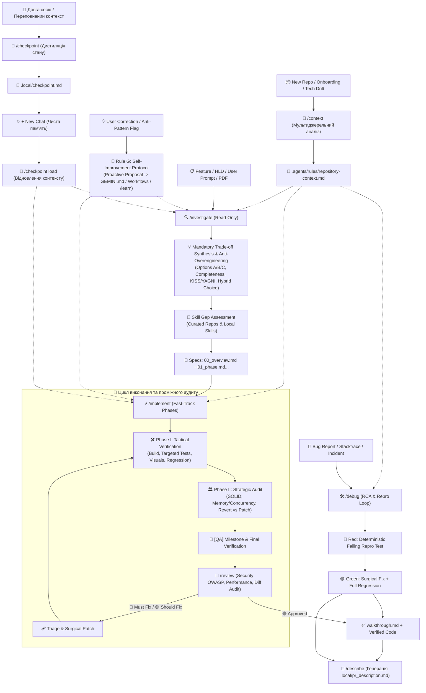

# Antigravity Workflows & Rules

Ця директорія містить оптимізовану інженерну конфігурацію, глобальні правила, воркфлови та повний набір спеціалізованих скілів для AI-агента **Google Antigravity**. Вони забезпечують надійний, автономний, самовдосконалюваний та безпечний цикл розробки програмного забезпечення на будь-якому стеку технологій.

---

## 🔄 Життєвий цикл розробки (End-to-End Pipeline)



---

## 📁 Структура директорій та встановлення

Конфігурація структурована за модульним принципом:

```
├── GEMINI.md                   # Глобальні правила, межі безпеки та протокол комунікації
└── config/
    ├── global_workflows/       # 7 основних воркфловів (Slash Commands)
    │   ├── context.md          # /context — ініціалізація та оновлення контексту репозиторія
    │   ├── investigate.md      # /investigate — аналіз, архітектура та декомпозиція
    │   ├── implement.md        # /implement — тактична розробка та стратегічний аудит
    │   ├── debug.md            # /debug — детермінований RCA та виправлення багів
    │   ├── review.md           # /review — аудит diff, безпека та статична верифікація
    │   ├── describe.md         # /describe — лаконічний опис PR (.local/pr_description.md)
    │   └── checkpoint.md       # /checkpoint — збереження та відновлення контексту між сесіями
    └── skills/                 # 33 спеціалізовані інженерні скіли (Domain Capabilities)
```

### Як підключити:

1. **Глобально для всіх проектів (Рекомендовано):**
   - Скопіюйте вміст `config/` у `~/.gemini/config/` (або `C:\Users\<user>\.gemini\config\`).
   - Скопіюйте `GEMINI.md` у `~/.gemini/config/rules/GEMINI.md`.
2. **Локально для окремого робочого простору:**
   - Розмістіть `GEMINI.md` у корені проєкту (або в `.agents/rules/GEMINI.md`).
   - Розмістіть воркфлови у `.agents/workflows/`, а скіли у `.agents/skills/`.

---

## 📜 Глобальні Правила (`GEMINI.md`)

- **Safety Boundaries (Rule C):** Захист від несанкціонованого встановлення пакетів, деструктивних Git-команд та небезпечних операцій з БД.
- **Surgical Edits (Rule D):** Точкові правки (Minimal Diff) без небажаного масового реформатування коду та з дотриманням відкритих контрактів.
- **Continuous Self-Improvement (Rule G):** Проактивна фіксація зауважень щодо помилок та формулювання правил для запобігання рецидивам.
- **Token Economics (Rule H):** Суворе ігнорування білд-артефактів, сучасних кеш-директорій (`.nuxt`, `.svelte-kit`, `.pytest_cache`) та великих lock-файлів.
- **Language Protocol (Rule A & E):** Комунікація з користувачем — мовою запиту, кодові артефакти та документація — суворо англійською.

---

## 🚀 Воркфлови (Slash Commands)

### 1. `/context` (Ініціалізація та оновлення контексту репозиторія)
**Файл:** `config/global_workflows/context.md`
- Мультиджерельний збір знань (користувацький запит + `README.md`/документація + маніфести коду та конфіги) в єдиний стандартизований файл `.agents/rules/repository-context.md`.
- **Non-Destructive Merge:** безпечно оновлює технічні факти (стек, команди, структура), зберігаючи всі кастомні правила та домовленості користувача.
- Забезпечує миттєвий старт будь-якої сесії без галюцинацій та зайвих розпитувань про архітектуру проєкту.

### 2. `/investigate` (Дослідження, синтез рішень та декомпозиція)
**Файл:** `config/global_workflows/investigate.md`
- Глибокий аналіз задач, архітектури (HLD/ADR/PDF) без модифікації робочого коду (**Read-Only**).
- **Mandatory Trade-off Synthesis:** обов'язковий порівняльний аналіз 2–3 підходів (Minimalist vs Enterprise vs Alternative) з оцінкою на 100% повноту вимог, захист від оверінжинірингу (KISS/YAGNI), Blast Radius та вибором або гібридним синтезом.
- Автоматичний підбір потрібних скілів під стек проєкту та планування проміжних QA-гейтів.
- Генерує майстер-план `.local/tasks/**/00_overview.md` (із секцією `Architecture Decisions & Trade-off Synthesis`) та фазові специфікації `01_<name>.md` з підтримкою рекурсивної декомпозиції на атомарні підфази (`01a`, `01b`) та обов'язкового фінального `[QA]`.

### 3. `/implement` (Автономна розробка та перевірка)
**Файл:** `config/global_workflows/implement.md`
- Працює у двох режимах: автономному (прямі задачі) та *Fast-Track* (підхоплює фази/підфази від `/investigate`).
- Двофазний цикл: **Phase I** (компіляція, точкові тести, візуальна верифікація) + **Phase II** (стратегічний аудит, Bidirectional Diff Reconciliation та чистота за SOLID).

### 4. `/debug` (RCA та усунення багів)
**Файл:** `config/global_workflows/debug.md`
- **Red-Before-Green Gate:** створення детермінованого падаючого тесту перед будь-якою зміною коду.
- Аналітичний аудит інваріантів (Zero/Boundary, витоки помилок/промісів) та точкове виправлення кореневої причини.

### 5. `/review` (Аудит коду та статична верифікація)
**Файл:** `config/global_workflows/review.md`
- Строге **read-only** рев'ю за протоколом *Static Flow Verification & Bidirectional Reconciliation*.
- Двостороння перевірка diff (100% покриття вимог і 0% незапитаного коду), OWASP-безпека, Blast Radius аудит.
- Працює для незакоміченого коду (`git diff HEAD`), гілок/PR (`git diff main...feature`) та історії комітів.

### 6. `/describe` (Генерація опису Pull Request)
**Файл:** `config/global_workflows/describe.md`
- Автоматично створює короткий, структурований опис PR у файл `.local/pr_description.md`.
- Conventional Commit Title, мотивація змін, покомпонентний список правок (Domain, API, DB, Config) та Breaking Changes.

### 7. `/checkpoint` (Збереження та відновлення контексту)
**Файл:** `config/global_workflows/checkpoint.md`
- Інтерактивно дистилює важливі знання сесії (багатозадачні напрямки, архітектурні рішення, стан коду, беклог) у `.local/checkpoint.md`.
- Дозволяє за допомогою команди `/checkpoint load` миттєво відновити повний робочий контекст у новій сесії з чистою пам'яттю (0% галюцинацій).

---

## 🧰 Каталог інженерних скілів (`config/skills/`)

Скіли розширюють можливості агента вузькоспеціалізованими експертними знаннями та найкращими інженерними практиками. Antigravity активує їх автоматично відповідно до контексту задачі:

| Категорія | Включені скіли | Призначення |
| :--- | :--- | :--- |
| **🏛️ Архітектура & Дизайн** | `architecture`, `architecture-decision-records`, `architect-review`, `backend-architect`, `api-design-principles`, `api-security-best-practices`, `database-design`, `brainstorming` | Проєктування систем, REST/GraphQL контрактів, ADR, безпека API та схем БД |
| **🤖 AI & Агенти** | `ai-agents-architect`, `ai-engineer`, `rag-engineer`, `prompt-engineering`, `antigravity-workflows` | Розробка автономних агентів, RAG-систем, оптимізація промптів та пам'яті |
| **💻 Мови & Фреймворки** | `csharp-pro`, `dotnet-backend-patterns`, `typescript-expert`, `javascript-pro`, `python-pro`, `react-best-practices`, `angular-best-practices`, `nodejs-best-practices` | Глибока експертиза в .NET/C#, TS/JS, Python, React, Angular та Node.js |
| **☁️ Хмара & Serverless** | `aws-skills`, `aws-serverless`, `azure-functions` | Архітектура та автоматизація в AWS (Lambda, CDK) та Azure Functions |
| **🧪 Якість & Рефакторинг** | `clean-code`, `production-code-audit`, `testing-patterns` | Принципи Clean Code, аудит продакшн-якості, TDD та патерни тестування |
| **🌐 RPA & Зворотний інжиніринг** | `mine-recording`, `rpa-capture` | 100% локальний аналіз відеодемонстрацій (FFmpeg + Whisper) та сесій у Chrome (CDP) |
| **📄 Документи & Звіти** | `pdf-official`, `docx-official`, `xlsx-official`, `pptx-official` | Програмна генерація та аналіз PDF, DOCX, XLSX та PPTX документів |

