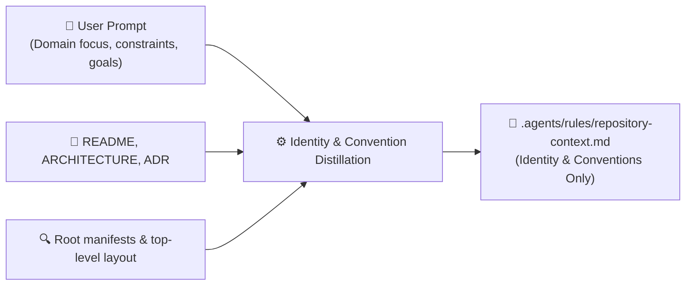

# Repository Meta-Context Initialization & Refresh Loop

Autonomously discovers and distills the **essential identity, domain purpose, and non-obvious architectural conventions** of the active workspace into **`.agents/rules/repository-context.md`**.

The goal is to capture **only what the user would otherwise have to re-explain every session** — project identity, business domain, and critical conventions that are not self-evident from the codebase. Technical details like runbooks, dependency lists, and file structures are intentionally excluded because the agent can discover them on-the-fly.

---

## Core Directives

- **Primary Target:** Creates or updates strictly **`.agents/rules/repository-context.md`** (ensuring `.agents/rules/` exists).
- **Identity-First, Minutiae-Never:** Capture **what** this project is, **why** it exists, and **how** the team expects it to work at the architectural level. **NEVER** document things the agent can trivially discover by reading manifests, directory listings, or script definitions (e.g., build commands, dependency versions, file inventories).
- **Ultra-Concise (20–40 lines max):** The resulting context file must be a dense, scannable cheat sheet — not a technical manual.
- **Read-Only Discovery Safety:** ZERO code modifications, package installations, or state-altering commands during analysis (**Rule C**).
- **Non-Destructive Merge:** If the file already exists, preserve all custom user-defined notes while updating stale facts.
- **Language Protocol:** The rule file MUST be in **English** (**Rule E**). User interaction follows the user's language (**Rule A**).

---

## Workflow Steps

### Step 1: Multi-Source Ingestion (Macro-Only)



#### 1. Source A: User Prompt & Intent
- Capture the user's high-level description: what this project is for, who uses it, specific architectural mandates, and negative constraints.

#### 2. Source B: Documentation
- Skim `README.md`, `ARCHITECTURE.md`, `docs/`, `ADR/` for domain purpose and architectural rationale only.

#### 3. Source C: Root Manifests & Top-Level Structure (Read-Only)
- Read root manifests (`package.json`, `*.sln`, `pyproject.toml`, `go.mod`, etc.) solely to identify the core tech stack and architecture style.
- Scan top-level directories to understand module/layer boundaries. **Do not enumerate files or sub-directories.**

---

### Step 2: Essential Context Distillation

Distill **only** what the agent cannot trivially discover on its own:

1. **System Identity & Domain:** What this project is, who it serves, and why it exists (1–3 sentences).
2. **Architecture Style & Core Stack:** The architectural pattern and primary technologies (a compact bullet list, not an exhaustive inventory).
3. **Module Boundaries:** A brief description of how the codebase is organized by responsibility — only top-level layers/packages.
4. **Non-Obvious Conventions & Invariants:** Critical team agreements, architectural guardrails, and domain rules that are **not self-evident from the code** (e.g., tenancy isolation strategy, error handling philosophy, migration policies, specific deployment model).
5. **Operational Context (Optional):** Only if the project has a non-standard or surprising operational model (e.g., "this monorepo deploys 3 independent services", "CI runs only on merge to `release/*`").

**Explicitly exclude:** build/test/lint commands, dependency version lists, individual file descriptions, ORM schema details, CI pipeline steps — the agent reads these directly when needed.

---

### Step 3: Diff & Non-Destructive Merge

1. Read existing `.agents/rules/repository-context.md` if present.
2. Preserve any custom user notes, business rules, or manual policies.
3. Update only stale identity/architecture facts.
4. Create `.agents/rules/` if missing and write the file.

---

### Step 4: Canonical Schema

Format `.agents/rules/repository-context.md` strictly according to this lean template:

```markdown
# Repository Meta-Context: <Project Name>

## System Identity & Domain
<1–3 sentences: What this project does, its business domain, target audience, and operational role.>

## Architecture & Tech Stack
- **Pattern:** <e.g., Clean Architecture | Modular Monolith | Microservices | Event-Driven>
- **Stack:** <e.g., .NET 9 / C# 13, ASP.NET Core Minimal APIs, PostgreSQL + EF Core, RabbitMQ>
- **Module Structure:** <1–2 sentences describing top-level layer/module boundaries and their responsibilities.>

## Non-Obvious Conventions & Guardrails
- <Convention 1: e.g., "All DB queries MUST include tenant isolation filter — no global queries allowed.">
- <Convention 2: e.g., "Domain layer is pure — zero infrastructure dependencies, no DI container references.">
- <Convention 3: e.g., "Error handling uses Result<T, E> pattern throughout; exceptions only for truly exceptional cases.">
- <Convention 4: e.g., "Migrations are append-only and idempotent — never modify existing migration files.">

## Operational Context
<Only if non-standard. E.g., deployment model, monorepo service topology, branch strategy, or special CI/CD constraints. Omit this section entirely if the project follows standard conventions.>
```

---

### Step 5: Delivery

1. **Verify Minimalism:** Ensure no discoverable technical details (commands, versions, file lists) leaked into the file. Target **20–40 lines**.
2. **Present Output:** Provide a clickable link to [`repository-context.md`](file:///.agents/rules/repository-context.md) and a brief summary in the user's language (**Rule A**).
