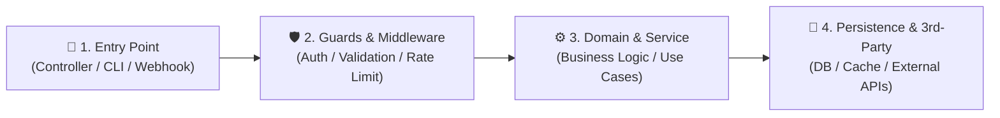
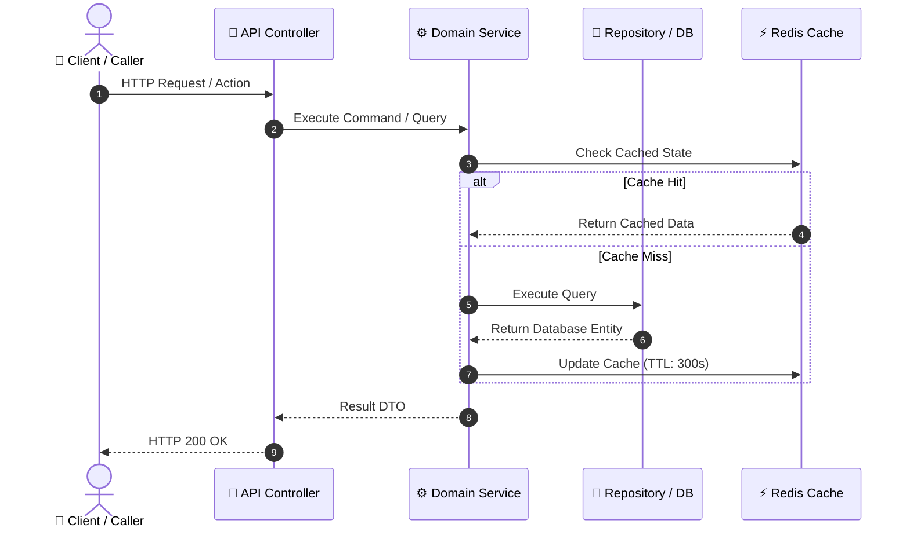

# Codebase Architecture & Data-Flow Tracing Loop

Autonomous, high-fidelity exploratory tracing of subsystems, features, data flows, and architectural boundaries in **strict Read-Only mode**. Delivers structured, evidence-based architectural walkthroughs with Mermaid sequence diagrams, call-stack breakdowns, and state/storage mapping without planning overhead or task decomposition.

---

## Core Directives

- **Strict Read-Only Safety:** ZERO code modifications, package installations, or state-altering commands (**Rule C**). Purely exploratory analysis and structured markdown delivery.
- **Verified Symbol & Call-Stack Tracing (Rule I):** Trace callers, callees, data models, and API endpoints using verified `grep_search` and range-limited `view_file`. Format all cited symbols with clickable line-range links (`[Symbol](file:///path#L10-L25)`). **Never speculate or fabricate signatures, paths, or execution flows from memory.**
- **Zero Planning Overhead:** Delivers answers directly in conversational output (or saves to `.local/explorations/<topic-slug>.md` only if explicitly requested with `--save`). Does NOT generate DAG plans, phase specifications, or DoD checklists.
- **Visual-First Clarity:** Every trace MUST include a Mermaid diagram (`sequenceDiagram` for request/response or event lifecycles, or `flowchart TD/LR` for multi-service/component topologies).
- **Storage & State Grounding:** Explicitly map data persistence (tables, columns, document collections), caching layers (Redis keys, TTLs, in-memory caches), and DTO transformations.
- **Language Protocol:** Code symbols, architectural diagrams, and technical terms MUST be in **English** (**Rule E**). Conversational explanations follow the user's active language (**Rule A**).

---

## Workflow Steps

### Step 1: Target Ingestion & Boundary Scoping

1. **Ingest Exploration Target:**
   - User queries: *"How does payment processing work?"*, *"Where is user session state stored?"*, *"Trace the order creation pipeline"*, `/explain auth`, `/explain data-sync --save`.
2. **Identify Exploration Scope:**
   - **Target Area:** Feature slice, API endpoint, background worker, domain entity, integration boundary, or data pipeline.
   - **Persistence Mode:** Default = Direct conversational response; If query includes `--save` or requests persistence = write to `.local/explorations/<YYYY-MM-DD>_<topic-slug>.md`.
3. **Locate Entry Points:**
   - **Web / API:** Route definitions, controllers, middleware, GraphQL resolvers, gRPC service methods.
   - **Event / Messaging:** Message queue consumers (RabbitMQ, Kafka, SQS, Azure Service Bus), event subscribers, webhook handlers.
   - **CLI / Job:** Console command entry points, cron/scheduled tasks, background hosted services.
   - **Frontend / Client:** UI action handlers, state management stores (Redux, Pinia, Zustand, NgRx), API client methods.

---

### Step 2: End-to-End Call-Stack & Data-Flow Tracing

Trace the complete execution pipeline sequentially across all architectural layers:

1. **Transport & Entry Layer:**
   - Extract route definitions, request/response models (DTOs), serialization settings, and input validation rules.
   - Trace authentication guards, permission filters, tenant resolvers, and middleware pipelines.
2. **Application & Domain Layer:**
   - Follow the call hierarchy into service classes, handlers (CQRS Command/Query), or domain aggregate roots.
   - Identify business rules, invariant validations, state machine transitions, and domain event emissions.
3. **Infrastructure & Persistence Layer:**
   - Identify repository methods, ORM queries (EF Core, Prisma, Drizzle, SQLAlchemy, Hibernate), raw SQL, or NoSQL lookups.
   - Trace external network calls: 3rd-party HTTP clients, cloud SDKs, message publishing.

---

### Step 3: State, Storage & Contract Mapping

Construct an explicit mapping of all state mutations and data contracts:

1. **Database & Schema Mutations:**
   - Identify tables, collections, foreign keys, and specific columns modified or queried.
   - Trace transaction boundaries (`BEGIN/COMMIT`, `TransactionScope`, atomic units of work).
2. **Caching & Ephemeral State:**
   - Identify Redis / Memcached keys, eviction policies, TTLs, and cache invalidation mechanisms.
   - Trace in-memory session state, process locks, or singleton state managers.
3. **Cross-Boundary Data Transformations:**
   - Trace mapping across DTOs $\leftrightarrow$ Domain Entities $\leftrightarrow$ Database Records $\leftrightarrow$ External Payloads.

---

### Step 4: Edge Case, Concurrency & Hazard Analysis

Analytically inspect potential failure modes and architectural bottlenecks along the traced path:

1. **Error Handling & Fault Tolerance:**
   - Trace exception handling, try-catch blocks, fallback responses, circuit breakers, and retry policies.
   - Verify unhandled exception bubblings or silent error swallows.
2. **Concurrency & Race Invariants:**
   - Inspect lock contention, async/await synchronization, database isolation levels (Read Committed, Serializable), and optimistic locking tokens (`rowversion`, `version` fields).
3. **Performance & Resource Invariants:**
   - Check for N+1 query patterns, missing index lookups on filter/join fields, unbounded list queries, and stream/socket disposal.

---

### Step 5: Structured Delivery

Deliver the explanation adhering to the standardized 5-part architecture report:

#### 1. Executive Summary
- Brief 1–3 sentence high-level overview of the subsystem, its responsibility, and architectural role.

#### 2. Architecture & Sequence Flow Diagram
- Render a clear, accurate Mermaid diagram illustrating the chronological or topological flow:

#### 3. Step-by-Step Call-Stack Walkthrough
- Numbered chronological trace with clickable file links and line ranges:
  1. **Entry Point:** [`OrdersController.cs#L35-L48`](file:///path/to/file) — Ingests request, validates payload.
  2. **Application Logic:** [`CreateOrderHandler.cs#L50-L75`](file:///path/to/file) — Checks inventory and calculates totals.
  3. **Data Mutation:** [`OrderRepository.cs#L80-L95`](file:///path/to/file) — Saves order entity within database transaction.

#### 4. Data & Storage Mapping Table
| Entity / Contract | Storage Target / Cache Key | Mutation Type | Description |
| :--- | :--- | :--- | :--- |
| `Order` | `orders` table | `INSERT` | Core order record with status `Pending` |
| `OrderSummaryDTO` | `cache:orders:{id}` (Redis) | `SETEX (TTL 600s)` | Cached projection for read endpoints |

#### 5. Concurrency, Failure Modes & Edge Hazards
- **Failure Handling:** How timeouts, connection drops, and invalid states are handled.
- **Concurrency & Races:** Potential race conditions or lock considerations.
- **Performance Notes:** Cache behavior, indexing status, and scalability constraints.

---

## Output Modes

- **Default (Standard):** Render the full structured explanation directly in the conversational output.
- **Persistence (`--save` flag):** In addition to the conversational response, write the complete report to `.local/explorations/<YYYY-MM-DD>_<topic-slug>.md` and provide a clickable link.
