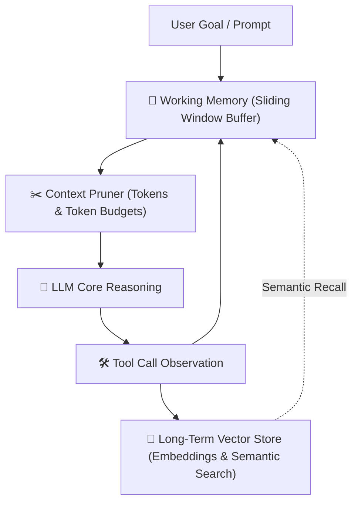

# AI Agents Architecture & Design Patterns

Comprehensive architectural guide for designing, implementing, and monitoring autonomous AI agents that act reliably in production environments with robust error boundaries and predictable cost envelopes.

---

## Core Principles of Autonomous Systems

- **Deterministic Iteration Limits:** Never allow unbounded execution loops. Every agent loop must have explicit `max_iterations`, `timeout_seconds`, and a hard circuit breaker.
- **Fail-Forward Tool Feedback:** When a tool call fails, feed the error back into the agent context as an observation with actionable error details so the agent can self-correct instead of crashing.
- **Strict Schema-Driven Function Calling:** Define tool contracts with strict JSON Schema or Zod/Pydantic models. Validate arguments before executing tool handlers.
- **State Separation:** Decouple agent core reasoning logic from state storage, memory stores, and external side-effect execution.

---

## 1. The ReAct (Reason-Act-Observe) Loop Architecture

```typescript
interface AgentStep {
  thought: string;
  action?: { name: string; args: Record<string, any> };
  observation?: string;
}

export class ReActAgent {
  private readonly maxIterations = 10;
  private readonly tools: Map<string, ToolDefinition>;

  constructor(tools: ToolDefinition[]) {
    this.tools = new Map(tools.map((t) => [t.name, t]));
  }

  async run(task: string): Promise<string> {
    const history: AgentStep[] = [];
    let iterations = 0;

    while (iterations < this.maxIterations) {
      iterations++;

      // 1. Reason: Prompt model with task, tool catalog, and execution history
      const step = await this.callLLM(task, history);
      history.push(step);

      // 2. Terminate on final answer
      if (!step.action) {
        return step.thought;
      }

      // 3. Act & Observe: Execute tool with defensive error mapping
      const tool = this.tools.get(step.action.name);
      if (!tool) {
        step.observation = `Error: Tool '${step.action.name}' does not exist. Available tools: ${Array.from(this.tools.keys()).join(', ')}`;
        continue;
      }

      try {
        const validatedArgs = tool.schema.parse(step.action.args);
        const result = await tool.execute(validatedArgs);
        step.observation = typeof result === 'string' ? result : JSON.stringify(result);
      } catch (err: any) {
        // Feedback error into context for self-correction
        step.observation = `Tool Execution Error: ${err.message}. Please adjust parameters.`;
      }
    }

    throw new Error(`Agent halted: Exceeded maximum iteration limit (${this.maxIterations}). Blocked on resolving task.`);
  }
}
```

---

## 2. Tool & Function Calling Registry

```typescript
import { z } from 'zod';

export interface ToolDefinition<T = any> {
  name: string;
  description: string;
  schema: z.ZodSchema<T>;
  execute: (args: T) => Promise<any>;
}

export const searchDatabaseTool: ToolDefinition = {
  name: 'search_database',
  description: 'Search customer records by email or account ID. Returns matched user metadata.',
  schema: z.object({
    query: z.string().min(3).describe('Email address or UUID of customer'),
    limit: z.number().int().min(1).max(20).default(5).describe('Maximum records to return'),
  }),
  execute: async ({ query, limit }) => {
    return await db.users.findMany({
      where: { OR: [{ email: query }, { id: query }] },
      take: limit,
    });
  },
};
```

---

## 3. Agent Memory Architecture



1. **Working Memory (Short-Term Buffer):** Last $N$ interaction steps with exact tool outputs.
2. **Summarization Memory:** Background compression when token count exceeds 70% of context window.
3. **Long-Term Episodic Memory:** Vector database (Qdrant, Pinecone, pgvector) storing past solved workflows for cross-session semantic recall.

---

## 4. Multi-Agent Orchestration Patterns

- **Supervisor / Router Pattern:** A central coordinator classifies user intent, breaks down DAG dependencies, routes atomic sub-tasks to specialized subagents, and synthesizes the final response.
- **Hierarchical Delegation:** Root Agent -> Lead Architect -> Implementation Workers. Workers execute in parallel and report back structured artifacts.
- **Human-in-the-Loop Gate:** High-risk actions (DB write, financial transaction, public email send) require explicit user approval before execution.

---

## 5. ⚠️ Production Sharp Edges & Solutions

| Vulnerability / Anti-Pattern | Severity | Root Cause | Architectural Solution |
| :--- | :--- | :--- | :--- |
| **Infinite Agent Looping** | 🔴 Critical | Ambiguous goal or repeating tool failure | Enforce `max_iterations = 10` and break on duplicate consecutive tool calls. |
| **Vague Tool Descriptions** | 🟡 High | Model guesses parameter formats | Write exhaustive tool docstrings with concrete JSON examples and constraints. |
| **Context Window Blowup** | 🟡 High | Dumping raw multi-MB tool outputs | Truncate and summarize tool outputs before appending to agent message history. |
| **Silent Tool Crashes** | 🔴 Critical | Uncaught exceptions break the loop | Catch tool errors and format them as descriptive `Observation: Error (...)` text. |
| **Tool Overload (Hallucination)** | 🟡 Medium | Passing >30 tools at once to the LLM | Use dynamic tool selection / routing: load only task-relevant tools. |
