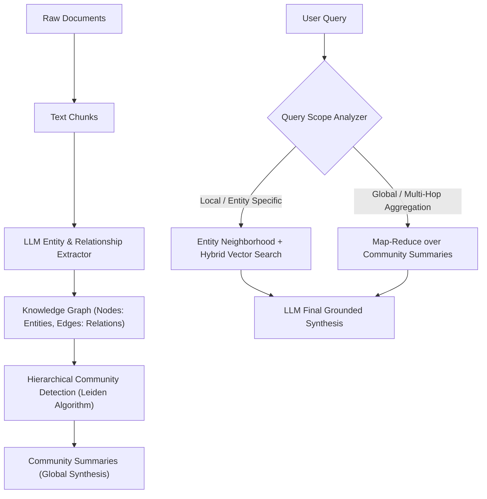
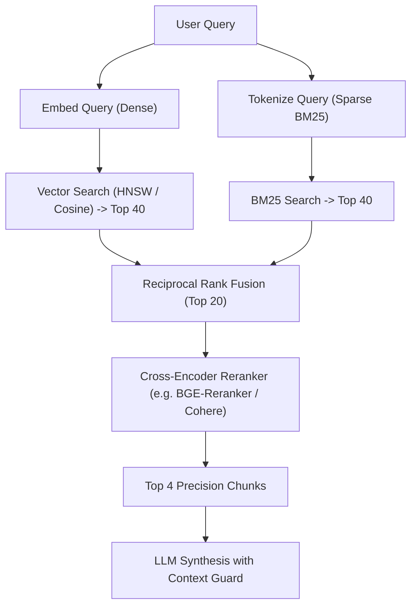

# Retrieval-Augmented Generation (RAG) Architecture

Production-grade engineering guide for designing, implementing, and evaluating high-precision Retrieval-Augmented Generation (RAG) systems with minimal hallucination rates and low retrieval latency.

---

## Core RAG Engineering Principles

- **Garbage In, Garbage Out:** Generation quality is bounded strictly by retrieval precision. Never compensate for poor chunking with longer prompt instructions.
- **Always Use Hybrid Search in Production:** Pure dense vector search fails on keyword exact matches, acronyms, product IDs, and error codes. Combine dense embeddings with sparse lexical search (BM25).
- **Two-Stage Retrieval (Retrieve -> Rerank):** Retrieve high-recall candidate pool ($K = 25\text{--}50$) in stage one, then apply a Cross-Encoder reranker to select the top $N = 3\text{--}5$ highest-precision chunks for the prompt context.
- **Separate Retrieval Evaluation from Generation:** Benchmark retrieval (Hit Rate, MRR, Context Precision) independently from LLM answer quality (Faithfulness, Groundedness).

---

## 1. Document Ingestion & Chunking Strategies

```python
from typing import List
import re

class SemanticDocumentChunker:
    """
    Splits documents on structural and semantic boundaries rather than fixed token lengths.
    Preserves section titles and metadata in chunk headers.
    """
    def __init__(self, target_chunk_size: int = 512, chunk_overlap: int = 64):
        self.target_chunk_size = target_chunk_size
        self.chunk_overlap = chunk_overlap

    def chunk_markdown(self, document_text: str, source_uri: str) -> List[dict]:
        # Split on Markdown headers while preserving hierarchy
        sections = re.split(r'(?=\n#{1,3}\s)', document_text)
        chunks = []

        for section in sections:
            if not section.strip():
                continue
            
            # Extract header if present
            header_match = re.match(r'^(#{1,3}\s[^\n]+)', section)
            current_header = header_match.group(1) if header_match else "General"
            
            paragraphs = section.split('\n\n')
            current_chunk = []
            current_len = 0

            for p in paragraphs:
                p_len = len(p.split())
                if current_len + p_len > self.target_chunk_size and current_chunk:
                    chunks.append({
                        "text": f"[{current_header}]\n" + "\n\n".join(current_chunk),
                        "metadata": {"source": source_uri, "section": current_header}
                    })
                    current_chunk = [p]
                    current_len = p_len
                else:
                    current_chunk.append(p)
                    current_len += p_len

            if current_chunk:
                chunks.append({
                    "text": f"[{current_header}]\n" + "\n\n".join(current_chunk),
                    "metadata": {"source": source_uri, "section": current_header}
                })

        return chunks
```

---

## 2. Hybrid Search with Reciprocal Rank Fusion (RRF)

```python
from collections import defaultdict
from typing import List, Dict

def reciprocal_rank_fusion(
    vector_results: List[Dict], 
    bm25_results: List[Dict], 
    k: int = 60, 
    top_n: int = 5
) -> List[Dict]:
    """
    Combines dense semantic rankings and sparse BM25 rankings without score normalization issues.
    Formula: RRF_Score = sum(1 / (k + rank_i))
    """
    rrf_scores = defaultdict(float)
    doc_map = {}

    # Process Dense Vector Rankings
    for rank, doc in enumerate(vector_results):
        doc_id = doc["id"]
        doc_map[doc_id] = doc
        rrf_scores[doc_id] += 1.0 / (k + rank + 1)

    # Process Sparse BM25 Rankings
    for rank, doc in enumerate(bm25_results):
        doc_id = doc["id"]
        doc_map[doc_id] = doc
        rrf_scores[doc_id] += 1.0 / (k + rank + 1)

    # Sort documents by fused RRF score descending
    sorted_doc_ids = sorted(rrf_scores.keys(), key=lambda d: rrf_scores[d], reverse=True)
    
    return [doc_map[doc_id] for doc_id in sorted_doc_ids[:top_n]]
```

---

## 3. GraphRAG & Knowledge Graph Architecture

Combines structured graph topology with unstructured vector embeddings to answer global, multi-hop, and relationship-dense queries where standard vector search fails.



### 3.1 Entity-Relation Triplet Extraction with Pydantic

```python
from typing import List, Literal
from pydantic import BaseModel, Field

class GraphEntity(BaseModel):
    """Extracted semantic entity."""
    name: str = Field(description="Normalized entity identifier (e.g., AuthService, Stripe, OrderAggregate)")
    type: Literal["SERVICE", "DATABASE", "DOMAIN_MODEL", "API_ENDPOINT", "PERSON", "ORGANIZATION", "CONCEPT"]
    description: str = Field(description="Comprehensive summary of the entity's responsibility and context in text")

class GraphRelationship(BaseModel):
    """Directed semantic relationship between entities."""
    source_entity: str = Field(description="Name of the source entity")
    target_entity: str = Field(description="Name of the target entity")
    relation_type: str = Field(description="Relationship predicate: CALLS | DEPENDS_ON | STORES | MUTATES | AUTHENTICATES")
    description: str = Field(description="Explanation of how the entities interact")
    weight: float = Field(default=1.0, ge=0.0, le=1.0, description="Confidence or frequency score")

class KnowledgeGraphPayload(BaseModel):
    """Complete graph extraction result per chunk."""
    entities: List[GraphEntity] = Field(default_factory=list)
    relationships: List[GraphRelationship] = Field(default_factory=list)
```

### 3.2 Hybrid Vector + Graph Query Routing Strategy

1. **Local Search (Entity Neighborhood):**
   - Extract mentioned entities from `UserQuery`.
   - Traverse 1-to-2 hop neighbors in the Knowledge Graph (`MATCH (e:Entity {name: $name})-[r]->(neighbor) RETURN e, r, neighbor`).
   - Fuse with top-$K$ semantic vector chunks.
2. **Global Search (Community Summaries):**
   - For broad thematic questions (*"What are the main architectural risks across all services?"*), retrieve pre-computed hierarchical **Community Summaries** (generated via Leiden community detection).
   - Execute parallel map-reduce synthesis over community summaries to avoid context window overflow.

---

## 4. Two-Stage Retrieval Pipeline Architecture



---

## 5. RAG Quality Evaluation Metrics (RAGAS Framework)

1. **Context Precision:** Percentage of retrieved chunks that are truly relevant to the query.
2. **Context Recall:** Whether all information required to answer the query was successfully retrieved.
3. **Faithfulness (Groundedness):** Percentage of claims in the generated answer that can be directly traced back to retrieved context (Zero Hallucination test).
4. **Answer Relevance:** Degree to which the synthesized answer directly addresses the original user question.

---

## 6. ⚠️ Production Sharp Edges & Solutions

| Failure Mode | Severity | Root Cause | Engineering Solution |
| :--- | :--- | :--- | :--- |
| **Fixed Token Chunking** | 🟡 High | Slicing code/sentences in the middle of words | Use recursive/semantic chunkers respecting Markdown headers and syntax boundaries. |
| **Exact Term Mismatch** | 🔴 Critical | Vector search misses exact UUIDs, SKUs, error codes | Implement **Hybrid Search (BM25 + Dense Vectors)** with RRF fusion. |
| **Lost In The Middle** | 🟡 High | LLM ignores relevant chunks placed in the middle of prompt | Place highest-scored chunks at the very beginning and very end of context window. |
| **Outdated Embeddings** | 🟡 High | Source documents updated without invalidating vector index | Implement event-driven CDC (Change Data Capture) or hash-based chunk re-indexing. |
| **Hallucination on Empty Retrieval** | 🔴 Critical | LLM generates answers when context has low similarity | Set a strict similarity threshold; instruct model: *"If information is missing, respond 'Insufficient context'."* |
| **Entity Resolution / Duplication** | 🟡 High | Extracted entities with slight variations (`StripeAPI` vs `Stripe`) create fragmented graph nodes | Apply entity normalization rules and cosine similarity clustering over entity embeddings before graph insertion. |
| **Knowledge Graph Schema Drift** | 🟡 High | LLM generates inconsistent relation predicates (`calls` vs `CALLS` vs `invokes`) | Enforce strict Pydantic `Literal` enums on `relation_type` and validate against an ontology schema. |
